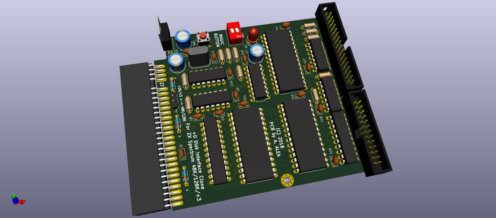
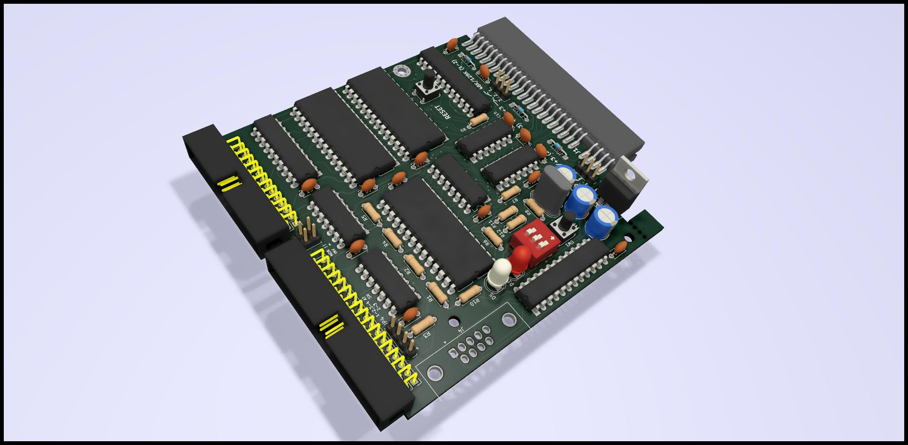
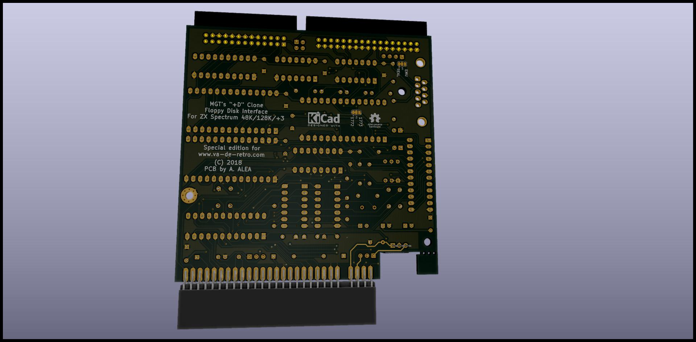

# The +D Interface Disk for ZX Spectrum
the schematic and PCB for this interfaz, make in KICAD
Including gerber files to direct order, the PCB is less than 10x10cm so it's very cheap.
Al BOM for order 10 units is also available, some PCB manufacturer allow to order at same time than PCB
Aditionaly ICs and Edge conector is needed.

IC for floppy controler is a dificult to found WD1772, in theory WD1770 can be used as a alternative.
Also WD1773, probably can be used, JP4 and JP5 must be changed to allow alternative motor control.
The interface has been only tested with WD1772 and VL1772-2PH

The Advantege of this interfaz over the original are:

- 4 Banks of ROM, so you can swap between G+Dos and Unidos, selectable by dip-switches

- Included Fixed for +2A/+3, so can be used in any ZX Spectrum, selection by jumpers

- Kempston Joystick Interface included, can be disable by dip-switch

- Reset Button

- Posibility of use crossed and plain floppy cable, and invert Drive 1 and Drive 2, very usefull if you have a Gotek and a real floppy.

